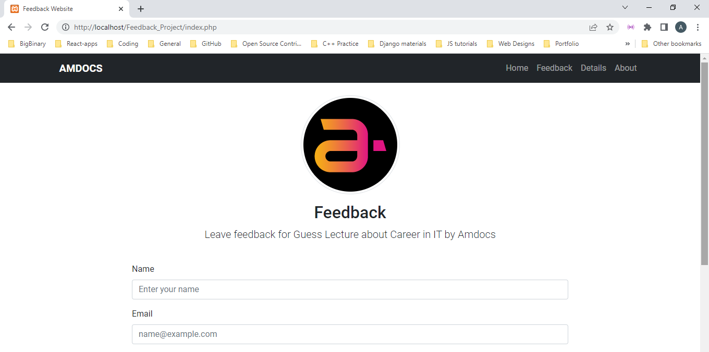
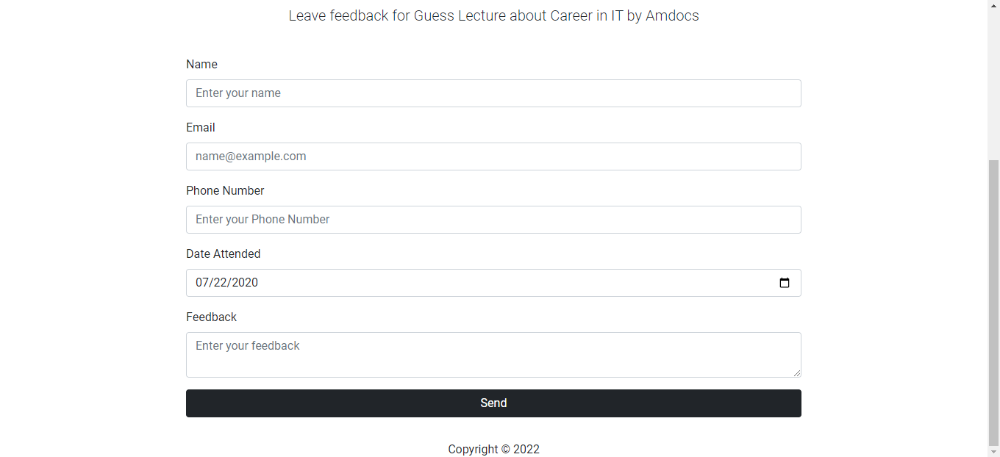
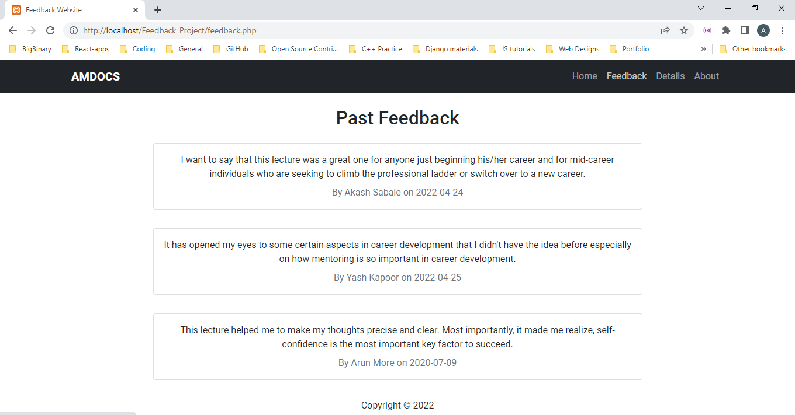
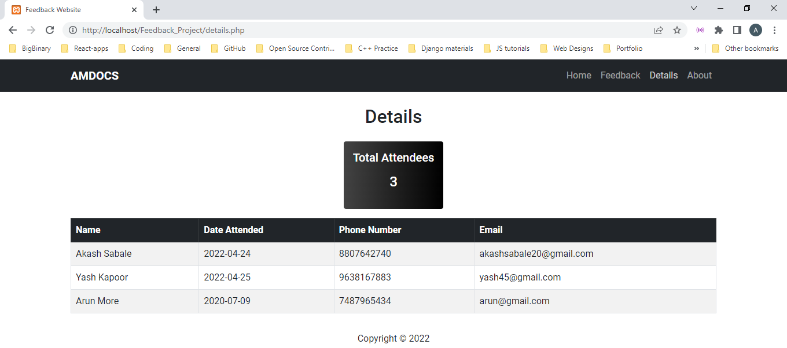
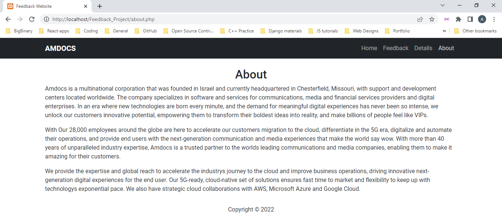

# Online-Feedback-System

Online Feedback System is a web based application that provides platform for the company to get
feedback of attendees. The purpose of feedback system is to gather information on learning as well as on
lecturer’s performance.

## Tech Stack

**Frontend :** HTML5, Bootstrap5

**Backend :** PHP, MySql

## Screenshots of Website

### Homepage

### Feedback Page

### Details Page

### About Page

